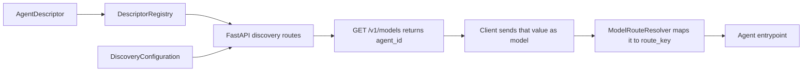

# Agent description and OpenAI model discovery

An `AgentDescriptor` is the provider-neutral description of an agent. It gives
clients a stable public name and tells them what the agent can do. Register a
descriptor with the FastAPI runtime to make it visible through OpenAI-compatible
model discovery:

- `GET /v1/models` lists visible agents.
- `GET /v1/models/{agent_id}` retrieves one visible agent.

The descriptor is metadata; it does not implement the agent or turn on an
endpoint capability. Your application still owns the handler, endpoint
configuration, authentication, and authorization.

## How discovery connects to invocation



The `agent_id` is public and stable. The `route_key` is an internal dispatch
name. Keeping them separate lets you change handler organization without
changing the identifier clients store, and keeps internal route names out of
discovery responses.

## 1. Describe the agent

Create an `AgentDescriptor` with the information clients should see. Required
fields are `agent_id`, `route_key`, `display_name`, `description`, `version`,
`owner`, `created_at_utc`, and `capabilities`.

```python
from datetime import datetime, timezone

from ygo74.agent_runtime.domains.discovery.agent_descriptor import (
    AgentCapabilitySet,
    AgentDescriptor,
    AgentSkill,
)

support_descriptor = AgentDescriptor(
    agent_id="support-assistant",
    route_key="support",
    display_name="Support Assistant",
    description="Answers customer questions about billing and subscriptions.",
    version="1.4.0",
    owner="customer-platform",
    # Use the descriptor's real, stable creation time in UTC.
    created_at_utc=datetime(2026, 9, 1, tzinfo=timezone.utc),
    capabilities=AgentCapabilitySet(
        streaming=False,
        input_modalities=("text",),
        output_modalities=("text",),
    ),
    tags=("billing", "customer-support"),
    skills=(
        AgentSkill(
            skill_id="invoice-lookup",
            name="Invoice lookup",
            description="Finds an invoice by number or date range.",
            examples=("Show me invoice 4471.",),
        ),
    ),
    metadata={"supportTier": "standard"},
)
```

The Python names are `snake_case`; the serialized descriptor schema uses
`camelCase`.

| Field | Required | Meaning and guidance |
|---|---:|---|
| `agent_id` | Yes | Public identifier returned as the model `id` and accepted in invocation requests. It must be 1–128 characters matching `^[A-Za-z0-9][A-Za-z0-9._:-]*$`. Matching is case-sensitive and whitespace is not trimmed. |
| `route_key` | Yes | Internal route selected for this agent. Keep it private; it is never included in model responses. |
| `display_name` | Yes | Human-readable name. |
| `description` | Yes | What the agent does; visible to discovery clients. |
| `version` | Yes | Version of this agent/use case, not necessarily the runtime package version. |
| `owner` | Yes | Owning team or provider label. It supplies OpenAI's `owned_by` field. |
| `created_at_utc` | Yes | Descriptor creation timestamp. Use a timezone-aware UTC `datetime`; OpenAI's `created` value is its Unix timestamp in seconds. |
| `capabilities` | Yes | Declared modality, streaming, tool-use, structured-output, and optional size-limit information. Defaults describe text input and output, with other capabilities disabled. |
| `documentation_url` | No | Public documentation URI for the agent. |
| `tags` | No | Search or grouping labels. |
| `skills` | No | Named things the agent can do, with descriptions, examples, and optional modality limits. Skill IDs must be unique within the descriptor. |
| `security_schemes` | No | Names of authentication schemes enforced for the agent. Never put credentials or tokens here. |
| `discovery_visibility` | No | `LISTED` by default; set to `DiscoveryVisibility.HIDDEN` to omit the agent from listings and direct model lookup. |
| `metadata` | No | Additional values projected to callers as public metadata. Do not put secrets, internal prompts, or caller-private data here. |

An `AgentSkill` has three required fields and four optional groups:

| Field | Required | Meaning |
|---|---:|---|
| `skill_id` | Yes | Stable identifier unique within this descriptor. |
| `name` | Yes | Short display name for the skill. |
| `description` | Yes | What the skill enables the agent to do. |
| `tags` | No | Labels to help a client or planner classify the skill. |
| `examples` | No | Example requests that fit the skill. |
| `input_modalities` / `output_modalities` | No | Skill-specific modalities, each a subset of the parent's capabilities. |

`security_schemes` is descriptive metadata; it does not configure or enforce
authentication by itself. Configure authentication through the FastAPI
registration options described below.

`AgentCapabilitySet` describes behavior; it does not enable that behavior.
Configure invocation endpoints and handler streaming separately, and only
advertise capabilities that clients can actually use. `AgentSkill` modality
claims must be subsets of the descriptor's input and output modalities.

The capability object contains these values:

| Python field | Serialized field | Meaning |
|---|---|---|
| `streaming` | `streaming` | Whether the agent can produce streamed responses. Defaults to `False`. |
| `input_modalities` | `inputModalities` | Non-empty tuple of accepted modalities; defaults to `("text",)`. |
| `output_modalities` | `outputModalities` | Non-empty tuple of produced modalities; defaults to `("text",)`. |
| `tool_invocation` | `toolInvocation` | Whether the agent can invoke tools; defaults to `False`. |
| `structured_output` | `structuredOutput` | Whether the agent can produce structured output; defaults to `False`. |
| `size_unit` | `sizeUnit` | Unit for declared input/output limits: `tokens`, `characters`, or `bytes`. It defaults to `tokens`; choose another unit explicitly if needed. |
| `max_input_size` / `max_output_size` | `maxInputSize` / `maxOutputSize` | Optional positive integer limits. The selected `size_unit` applies to both. |
| `extensions` | `extensions` | Additional capability facts projected to discovery clients. |

An `AgentSkill` requires `skill_id`, `name`, and `description`; `tags` and
`examples` are optional. Its optional input/output modalities cannot exceed the
modalities declared by the parent descriptor.

The runtime's helper validations are explicit. `DescriptorRegistry` rejects a
duplicate `agent_id`, but endpoint registration does not automatically validate
that every `route_key` resolves to a handler or that every capability matches
the endpoint configuration. Where those checks apply to your application, use
[`DescriptorBinding`](../../packages/python/agents/ygo74/agent_runtime/domains/discovery/descriptor_binding.py)
and
[`CapabilityValidator`](../../packages/python/agents/ygo74/agent_runtime/domains/discovery/capability_validator.py)
from the discovery package before serving traffic.

### Derive a minimal descriptor explicitly

`DescriptorDefaults` can build a minimal descriptor from a route key when you
do not have richer public metadata yet:

```python
from ygo74.agent_runtime.domains.discovery.descriptor_defaults import DescriptorDefaults

descriptor = DescriptorDefaults(owner="customer-platform", version="1.0.0").derive(
    "support/billing"
)
```

This utility must be called explicitly; FastAPI registration does not derive a
descriptor automatically. It replaces characters unsafe for an agent ID with
hyphens and uses the resulting ID as the `display_name`. Its generated
description includes the original route key, so use it only when that key is
safe to disclose. A derived descriptor does not infer your agent's skills or
capabilities; declare a full descriptor when clients need accurate information.

## 2. Register the descriptor

Put descriptors in a `DescriptorRegistry`. The registry provides exact lookup
by public ID and orders listings by ascending, case-sensitive `agent_id`.

```python
from ygo74.agent_runtime.domains.discovery.descriptor_registry import DescriptorRegistry

descriptor_registry = DescriptorRegistry([support_descriptor])
```

### Combined registration

For the usual setup, use `add_ai_endpoints` to register invocation routes and
discovery routes together. Both `descriptor_registry` and `discovery` must be
provided for discovery routes to be added.

```python
from ygo74.agent_runtime.domains.discovery.discovery_configuration import (
    DiscoveryConfiguration,
)
from ygo74.agent_runtime.domains.endpoints.fastapi_endpoints import add_ai_endpoints

add_ai_endpoints(
    app,
    agent_entrypoint,
    default_route_key="support",
    descriptor_registry=descriptor_registry,
    discovery=DiscoveryConfiguration(enable_openai_models=True),
)
```

The app must be an existing FastAPI application and `agent_entrypoint` must be
your handler. OpenAI Responses and Chat Completions routes are enabled by
default; see the [agent runtime guide](agent-runtime.md) for endpoint options.
Passing the same registry here also lets the runtime map a listed model ID back
to its internal route when a client invokes the agent.

### Separate discovery registration

Use `add_discovery_endpoints` when you want to register model discovery
separately from invocation routes, or when invocation endpoints are configured
elsewhere:

```python
from ygo74.agent_runtime.domains.discovery.discovery_configuration import (
    DiscoveryConfiguration,
)
from ygo74.agent_runtime.domains.endpoints.fastapi_endpoints import (
    add_discovery_endpoints,
)

add_discovery_endpoints(
    app,
    descriptor_registry,
    DiscoveryConfiguration(enable_openai_models=True),
)
```

This method registers model-listing and model-detail routes only. It does not
register invocation endpoints. If you also use `add_ai_endpoints`, pass the same
`descriptor_registry` there so model IDs resolve to route keys, but leave out
its `discovery` argument; otherwise both calls try to register the same
discovery paths. The direct method accepts optional `authenticator` and
`access_policy` arguments for discovery authentication and visibility filtering.

With either method, no model routes are added unless an OpenAI or Anthropic
model surface is enabled. For this OpenAI topic, set
`enable_openai_models=True`. `route_prefix` can mount these routes under a path
prefix; for example, `route_prefix="/runtime"` changes the list path to
`/runtime/v1/models`.

The main configuration options for this topic are:

| Option | Default | Effect |
|---|---|---|
| `enable_openai_models` | `False` | Enables the OpenAI model list and single-model routes. |
| `enable_anthropic_models` | `False` | Enables the Anthropic projection. If both providers are enabled, the shared path selects a dialect from request headers; explicit `/openai/...` and `/anthropic/...` paths are also registered. |
| `dialect_selection` | `DialectSelection.HEADER` | Controls the shared `/v1/models` path. With the default, no `anthropic-version` header selects OpenAI; a supported version selects Anthropic. |
| `require_authentication` | `False` | Requires discovery callers to authenticate. Supply an authenticator if this is enabled. |
| `route_prefix` | `""` | Adds a prefix to the model route paths. |

## 3. Read the model listing

When only OpenAI model discovery is enabled, request:

```bash
curl -sS http://127.0.0.1:8001/v1/models
```

The response has the OpenAI list envelope. The `data` entries use OpenAI's
native model fields where available; the runtime's additional agent details are
grouped under `x-agent-runtime`:

```json
{
  "object": "list",
  "data": [
    {
      "id": "support-assistant",
      "object": "model",
      "created": 1788220800,
      "owned_by": "customer-platform",
      "x-agent-runtime": {
        "displayName": "Support Assistant",
        "description": "Answers customer questions about billing and subscriptions.",
        "version": "1.4.0",
        "owner": "customer-platform",
        "tags": ["billing", "customer-support"],
        "capabilities": {
          "streaming": false,
          "inputModalities": ["text"],
          "outputModalities": ["text"],
          "toolInvocation": false,
          "structuredOutput": false,
          "extensions": {}
        },
        "skills": [
          {
            "skillId": "invoice-lookup",
            "name": "Invoice lookup",
            "description": "Finds an invoice by number or date range.",
            "tags": [],
            "examples": ["Show me invoice 4471."]
          }
        ],
        "securitySchemes": [],
        "metadata": {"supportTier": "standard"}
      }
    }
  ]
}
```

`created` is calculated from `created_at_utc`; the value above corresponds to
the example's September 1, 2026 timestamp. The extension contains
`displayName`, `description`, `version`, `owner`, `tags`, `capabilities`,
`skills`, and `securitySchemes`. `documentationUrl` and non-empty `metadata`
appear only when supplied. The internal `route_key` is never returned.

An empty registry, or a registry containing only hidden agents, returns HTTP
200 with `{"object":"list","data":[]}`. An unknown or hidden ID requested
from the detail route returns 404. IDs are matched exactly, including case.

If both OpenAI and Anthropic model discovery are enabled and the default
header-based `dialect_selection` is in use, the shared `/v1/models` path selects
a response format from the request headers: without an `anthropic-version`
header it defaults to OpenAI; with a supported Anthropic version it returns the
Anthropic format. Provider-specific override paths are registered only when
both model surfaces are enabled. Anthropic response fields and pagination are
outside this topic.

## 4. Retrieve one model and invoke it

Retrieve a single model using the exact public ID:

```bash
curl -sS http://127.0.0.1:8001/v1/models/support-assistant
```

This returns the same model entry shown in the list. Copy its `id` into the
`model` field when calling an enabled invocation endpoint:

```bash
curl -sS http://127.0.0.1:8001/v1/responses \
  -H 'Content-Type: application/json' \
  -d '{"model":"support-assistant","input":"Find invoice 4471."}'
```

With a matching descriptor registry passed to `add_ai_endpoints`, the runtime
resolves `support-assistant` to the descriptor's `route_key` (`support`) before
dispatching the request. An explicit `metadata.route_key` or top-level
`route_key` takes precedence. An unknown model ID does not currently produce an
unknown-model error; it falls back to `default_route_key`. If your application
needs strict rejection of unknown IDs, validate the model before dispatch.

The descriptor route must match the route registered by your application. The
standalone `DescriptorBinding` helper can check this relationship against a
`RouteRegistry`; it is not called automatically by either FastAPI registration
method.

## Common setup problems

| Symptom | Check |
|---|---|
| `GET /v1/models` returns 404 | Confirm both `descriptor_registry` and `discovery` were passed to `add_ai_endpoints`, or that `add_discovery_endpoints` was called; confirm `enable_openai_models=True` and check `route_prefix`. |
| The list succeeds but `data` is empty | Confirm the registry contains descriptors and that their `discovery_visibility` is `LISTED`; an empty catalogue is a successful empty result. |
| A listed ID returns 404 on the detail route | Use the exact `id`, preserving case and removing surrounding whitespace. Check whether an access policy filters the descriptor for this caller. |
| The request runs the default handler | Confirm the request's `model` exactly matches a registered `agent_id`, the same registry was given to `add_ai_endpoints`, and no explicit `route_key` overrides it. Unknown model IDs currently fall back to `default_route_key`. |

## 5. Visibility and access control

Discovery is opt-in. `DiscoveryConfiguration` defaults both model surfaces to
disabled. Discovery authentication is optional by default; set
`require_authentication=True` and provide an authenticator when only
authenticated callers may list or retrieve models.

`DiscoveryVisibility.HIDDEN` removes a descriptor from listings and makes
direct retrieval return the same 404 as an unknown ID. Hiding is a discovery
choice, not invocation authorization: it does not by itself prevent someone
from invoking a route they can otherwise reach. Use an `AgentAccessPolicy` when
visibility and invocation must depend on the authenticated caller. With the
combined `add_ai_endpoints` setup, pass it as `authorization_policy`; that
policy filters discovery and gates invocation. With separate registration,
pass the same policy as `authorization_policy` to `add_ai_endpoints` and as
`access_policy` to `add_discovery_endpoints`. See the [authorization guide](../examples/python-langchain-fastapi/authorization.md)
for a fuller access-control walkthrough.

The list and detail responses contain public metadata. Keep private details in
your application configuration, not in `description`, `skills`, `security_schemes`,
or `metadata`.

## Runnable example and references

The [LangChain + FastAPI example](../examples/python-langchain-fastapi/01-get-started/README.md)
declares a descriptor in
[`openai_responses_app.py`](../examples/python-langchain-fastapi/01-get-started/openai_responses_app.py)
and enables model discovery. It requires the prerequisites listed in that
example, including an OpenAI API key. The model-listing request itself does not
call the model provider.

- [Agent descriptor schema](../../specs/001-openai-endpoint-exposure/contracts/agent-descriptor-v1.schema.json)
- [Endpoint surface contract](../../specs/001-openai-endpoint-exposure/contracts/endpoint-surface-contract.md)
- [Configuration walkthrough](../examples/python-langchain-fastapi/configuration.md)
- [Authorization walkthrough](../examples/python-langchain-fastapi/authorization.md)
- [Python implementation: descriptor](../../packages/python/agents/ygo74/agent_runtime/domains/discovery/agent_descriptor.py)
- [Python implementation: descriptor defaults](../../packages/python/agents/ygo74/agent_runtime/domains/discovery/descriptor_defaults.py)
- [Python implementation: descriptor registry](../../packages/python/agents/ygo74/agent_runtime/domains/discovery/descriptor_registry.py)
- [Python implementation: discovery configuration](../../packages/python/agents/ygo74/agent_runtime/domains/discovery/discovery_configuration.py)
- [Python implementation: FastAPI registration](../../packages/python/agents/ygo74/agent_runtime/domains/endpoints/fastapi_endpoints.py)

The descriptor is shared as a provider-neutral source for other discovery
surfaces as well. Anthropic model discovery and A2A agent-card usage will have
their own topic pages; this page covers the OpenAI `v1/models` surface.
