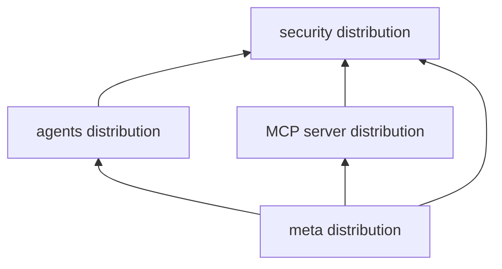

# Component model

The repository groups code by domain and language. The layers below describe
responsibilities; they are not all connected automatically by one runtime
container.

## Core domains

| Domain | Responsibility | Current implementation |
|---|---|---|
| Contracts | Normalized request, response, error, and stream values | Python, .NET, Java |
| Endpoint adapters and mapping | Identify provider dialects and convert inputs/results | Python HTTP adapter; mapping building blocks in .NET and Java |
| Configuration | Bind route/endpoint settings and load delivered agent configuration | Python models plus optional `.env` and YAML loaders/schemas; .NET options; Java properties |
| Authentication | Validate credentials and project caller identity | Python security distribution; authentication classes in .NET and Java |
| Reasoning | Framework-neutral async text-reasoning port and typed result/errors | Python |
| Routing | Resolve a route key and invoke a registered handler | Python, .NET, Java |
| Middleware | Ordered pre-handler and post-handler extension points | Python, .NET, Java |
| Agent discovery | Describe agents and project provider model listings | Python |
| Application security | Permissions, operation posture, audit, user context, and untrusted input | Python |
| Agent context and common errors | Build user context from caller-supplied identity/permissions; shared Python domain error base | Python |
| Sessions | Typed conversation container, HTTP turn engine, and runtime cache | Python |
| Human approval | Confirmation/gating primitives and bounded approval-loop orchestration | Python |
| MCP client | Generic bindings, connection lifecycle, and dialect registry | Python |
| MCP server | Authenticated server hosting | Separate Python distribution |
| Observability | Standard logging and telemetry integration hooks | Python, .NET, Java; telemetry hooks are incomplete placeholders |

## Dependency direction

The shared exchange contracts are the language-neutral boundary between
transport and application code. Endpoint adapters create or consume those
values. Routing depends on the exchange request/response and handler interfaces.
Middleware wraps handler execution through a context and continuation
callback. Observability is an integration surface, not part of provider payload
mapping.

Python packages preserve an additional dependency boundary:

The security package does not depend on the agent package. Both agent hosting
and MCP server hosting reuse its authentication contracts without forcing an
MCP server to install agent discovery, session, or conversation code. The
agents distribution includes an MCP **client** as an optional extra and the
configuration loader as a separate `configuration` extra. The separate MCP
distribution provides an MCP **server**. Configuration loading does not require
the HTTP or MCP extras.

## Language package boundaries

- Python contributes portions to the `ygo74.agent_runtime` namespace. Import
  concrete domain modules; there is no flat package facade. FastAPI, MCP SDK,
  and server transport dependencies are optional extras.
- .NET ships the `Ygo74.AgentRuntime` library targeting .NET 8. Its current
  project references logging abstractions and does not reference ASP.NET Core.
- Java ships `ygo74-agent-runtime` as a Java 21 library. Its runtime has no
  Spring dependency.

The common endpoint contract must not be read as proof that every language has
the same hosting adapter. Current differences are listed in [language support
and parity](../compatibility/language-status.md).
