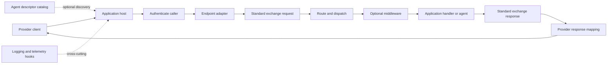

# System overview

## Purpose

AI Enterprise Agent Runtime is a set of reusable libraries for connecting
application-owned agent or use-case logic to provider-compatible request
formats. It separates transport payloads from application logic through a
common exchange model and supplies reusable routing, authentication, and
middleware components.

The library does not implement an agent, choose a model provider, own business
data, or decide application-specific permissions. The host application selects
its agent framework, supplies handlers, owns external service clients, and
composes the runtime components it needs.

## Request lifecycle

The common conceptual flow is:

The ordering and available adapters depend on the language package. Python has
a FastAPI adapter that performs the complete HTTP invocation flow. The .NET
and Java packages currently provide exchange, mapping, routing, authentication,
and middleware building blocks without a built-in ASP.NET Core or Spring HTTP
host adapter.

## Runtime boundaries

- **Host boundary:** The application creates the web or MCP server and decides
  which runtime features to register.
- **Provider boundary:** OpenAI-compatible Chat Completions and Responses, and
  Anthropic-compatible Messages, are the supported invocation dialects in the
  core contract. The Python FastAPI adapter exposes them as HTTP routes.
- **Handler boundary:** Application logic receives normalized request data and
  returns a normalized result. Provider-specific details are handled by the
  adapter where implemented.
- **Identity boundary:** A configured authenticator validates credentials and
  creates an authenticated caller context. Business authorization remains an
  application decision.
- **State boundary:** Built-in Python conversation caches and in-memory
  approval stores are process-local. Durable or shared state is supplied by an
  application implementation of the corresponding protocol.
- **Tool boundary:** The Python agent package can connect to MCP servers; the
  separately packaged Python MCP host can expose an MCP server. These are
  distinct roles.

## Supported endpoint names

The canonical endpoint type identifiers are:

- `openai.chat_completions`
- `openai.responses`
- `anthropic.messages`

The same identifiers are used inside exchange requests across the language
packages. The runtime currently has no A2A agent-card or AG-UI endpoint adapter.

## Deliberate ownership

The runtime owns stable contracts and common infrastructure. Applications own
agent prompts and execution, domain-specific tools, permissions, policy
decisions, identity-provider provisioning, persistence, and framework-specific
approval interactions. See the [component model](component-model.md) and
[language support](../compatibility/language-status.md) for package-level
boundaries and current implementation differences.
